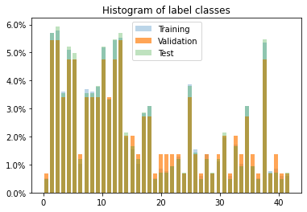
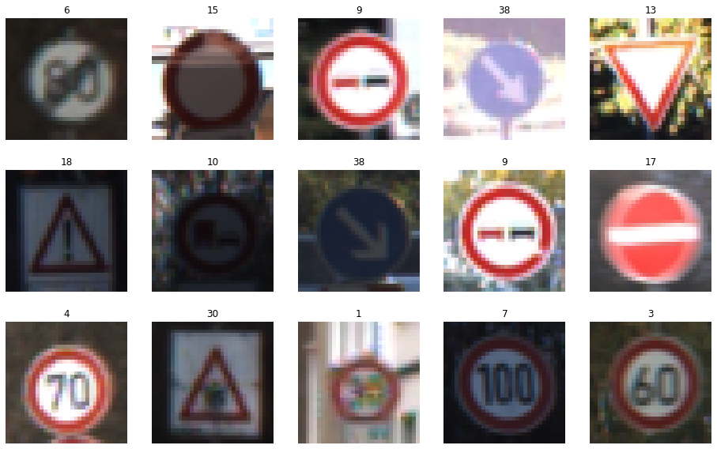
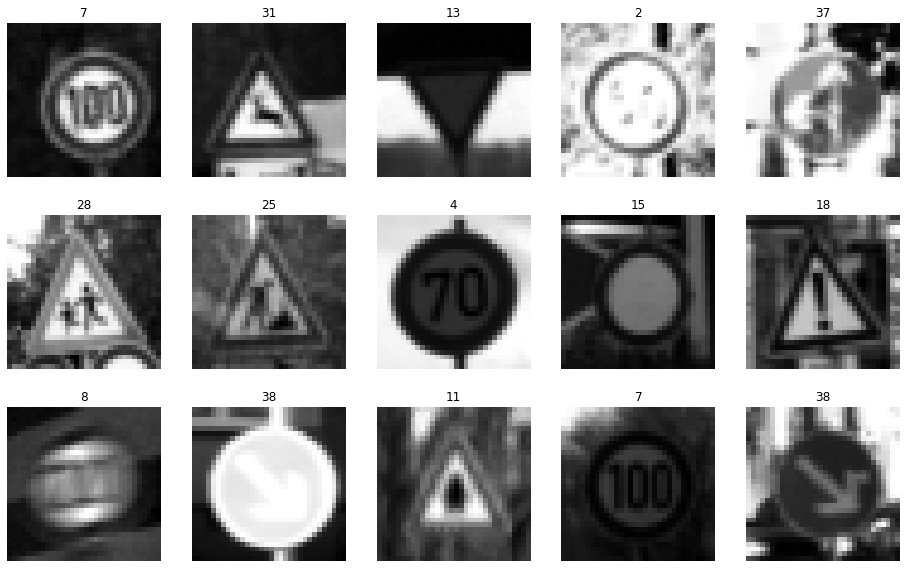
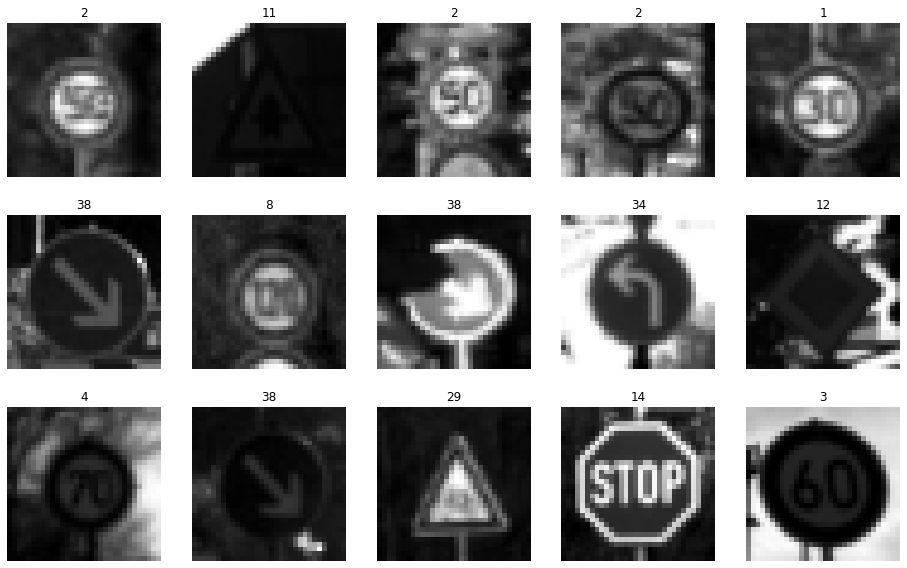
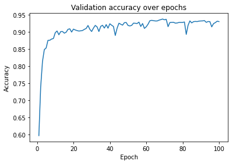
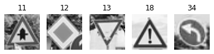
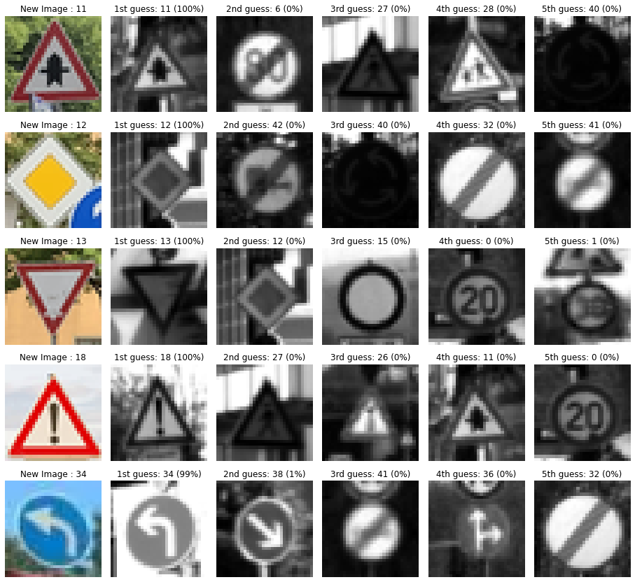

## Project: Build a Traffic Sign Recognition Program
[](http://www.udacity.com/drive)

Overview
---
In this project, you will use what you've learned about deep neural networks and convolutional neural networks to classify traffic signs. You will train and validate a model so it can classify traffic sign images using the [German Traffic Sign Dataset](http://benchmark.ini.rub.de/?section=gtsrb&subsection=dataset). After the model is trained, you will then try out your model on images of German traffic signs that you find on the web.

We have included an Ipython notebook that contains further instructions 
and starter code. Be sure to download the [Ipython notebook](https://github.com/udacity/CarND-Traffic-Sign-Classifier-Project/blob/master/Traffic_Sign_Classifier.ipynb). 

We also want you to create a detailed writeup of the project. Check out the [writeup template](https://github.com/udacity/CarND-Traffic-Sign-Classifier-Project/blob/master/writeup_template.md) for this project and use it as a starting point for creating your own writeup. The writeup can be either a markdown file or a pdf document.

To meet specifications, the project will require submitting three files: 
* the Ipython notebook with the code
* the code exported as an html file
* a writeup report either as a markdown or pdf file 

Creating a Great Writeup
---
A great writeup should include the [rubric points](https://review.udacity.com/#!/rubrics/481/view) as well as your description of how you addressed each point.  You should include a detailed description of the code used in each step (with line-number references and code snippets where necessary), and links to other supporting documents or external references.  You should include images in your writeup to demonstrate how your code works with examples.  

All that said, please be concise!  We're not looking for you to write a book here, just a brief description of how you passed each rubric point, and references to the relevant code :). 

You're not required to use markdown for your writeup.  If you use another method please just submit a pdf of your writeup.

The Project
---
The goals / steps of this project are the following:
* Load the data set
* Explore, summarize and visualize the data set
* Design, train and test a model architecture
* Use the model to make predictions on new images
* Analyze the softmax probabilities of the new images
* Summarize the results with a written report

### Dependencies
This lab requires:

* [CarND Term1 Starter Kit](https://github.com/udacity/CarND-Term1-Starter-Kit)

The lab environment can be created with CarND Term1 Starter Kit. Click [here](https://github.com/udacity/CarND-Term1-Starter-Kit/blob/master/README.md) for the details.

### Dataset and Repository

1. Download the data set. The classroom has a link to the data set in the "Project Instructions" content. This is a pickled dataset in which we've already resized the images to 32x32. It contains a training, validation and test set.
2. Clone the project, which contains the Ipython notebook and the writeup template.
```sh
git clone https://github.com/udacity/CarND-Traffic-Sign-Classifier-Project
cd CarND-Traffic-Sign-Classifier-Project
jupyter notebook Traffic_Sign_Classifier.ipynb
```

### Requirements for Submission
Follow the instructions in the `Traffic_Sign_Classifier.ipynb` notebook and write the project report using the writeup template as a guide, `writeup_template.md`. Submit the project code and writeup document.

---

# **Writeup for submission** 

Dependencies:
* pickle
* numpy
* sklearn
* tensorflow 
* cv2
* glob

---

## Dataset Exploration
#### Dataset Summary
First load 3 datasets - train, valid and test sets
Then print the summary.
```
Number of total examples = 51839
Number of training examples = 34799
Mean of training examples = 82.677589, Standard Deviation = 67.850888
Number of validation examples = 4410
Mean of validation examples = 83.556427, Standard Deviation = 69.887713
Number of testing examples = 12630
Mean of testing examples = 82.148460, Standard Deviation = 68.744089
Image data shape = (32, 32)
Number of classes = 43
```
Then plot the distribution of label sets as follows

<p align="center">
  
</p>

#### Exploratory Visualization
Display randomly the training set data with label
<p align="center">
  
</p>

---

## **Design and Test a Model Architecture**
#### Preprocessing
Before putting training data into pipeline, data needs to be pre-processed
First step, grayscaled:
```
X_train_gray = np.sum(X_train/3, axis=3, keepdims=True)
X_valid_gray = np.sum(X_valid/3, axis=3, keepdims=True)
X_test_gray = np.sum(X_test/3, axis=3, keepdims=True)
```
<p align="center">
  
</p>

Then normalized:
```
X_train_normalized = (X_train_gray - 128)/128
X_valid_normalized = (X_valid_gray - 128)/128
X_test_normalized = (X_test_gray - 128)/128
```
<p align="center">
  
</p>

#### Model Architecture
<p align="center">
  
</p>
LeNet architecture is defined as follows:

```
def LeNet(x, n_classes):    
    # Arguments used for tf.truncated_normal, randomly defines variables for the weights and biases for each layer
    mu = 0 # mean
    sigma = 0.1 # standard deviation
    
    # TODO: Layer 1: Convolutional. Input = 32x32x1. Output = 28x28x6.
    stride1 = 1
    conv1_W = tf.Variable(tf.truncated_normal(shape=(5, 5, 1, 6), mean = mu, stddev = sigma))
    conv1_b = tf.Variable(tf.zeros(6))
    conv1 = tf.nn.conv2d(x, conv1_W, strides=[1, stride1, stride1, 1], padding='VALID') + conv1_b
    print("conv1 shape : ", conv1.get_shape())

    # TODO: ReLu Activation.
    conv1 = tf.nn.relu(conv1)

    # TODO: Max Pooling. Input = 28x28x6. Output = 14x14x6.
    conv1 = tf.nn.max_pool(conv1, ksize=[1, 2, 2, 1], strides=[1, 2, 2, 1], padding='VALID')
    print("conv1 shape after max pooling : ", conv1.get_shape())

    # TODO: Layer 2: Convolutional. Output = 10x10x16.
    stride2 = 1
    conv2_W = tf.Variable(tf.truncated_normal(shape=(5, 5, 6, 16), mean = mu, stddev = sigma))
    conv2_b = tf.Variable(tf.zeros(16))
    conv2 = tf.nn.conv2d(conv1, conv2_W, strides=[1, stride2, stride2, 1], padding='VALID') + conv2_b
    print("conv2 shape : ", conv2.get_shape())
    
    # TODO: ReLu Activation.
    conv2 = tf.nn.relu(conv2)

    # TODO: Max Pooling. Input = 10x10x16. Output = 5x5x16.
    conv2 = tf.nn.max_pool(conv2, ksize=[1, 2, 2, 1], strides=[1, 2, 2, 1], padding='VALID')
    print("conv2 shape after max pooling : ", conv2.get_shape())

    # TODO: Flatten. Input = 5x5x16. Output = 400.
    fc0 = flatten(conv2)
    print("Fully connected layer fc0 shape : ", fc0.get_shape())
    
    # TODO: Layer 3: Fully Connected. Input = 400. Output = 120.
    fc1_W = tf.Variable(tf.truncated_normal(shape=(400, 120), mean = mu, stddev = sigma))
    fc1_b = tf.Variable(tf.zeros(120))
    fc1 = tf.matmul(fc0, fc1_W) + fc1_b
    print("Fully connected layer fc1 shape : ", fc1.get_shape())
    
    # TODO: ReLu Activation.
    fc1 = tf.nn.relu(fc1)

    # TODO: Layer 4: Fully Connected. Input = 120. Output = 84.
    fc2_W = tf.Variable(tf.truncated_normal(shape=(120, 84), mean = mu, stddev = sigma))
    fc2_b = tf.Variable(tf.zeros(84))
    fc2 = tf.matmul(fc1, fc2_W) + fc2_b
    print("Fully connected layer fc2 shape : ", fc2.get_shape())
    
    # TODO: ReLu Activation.
    fc2 = tf.nn.relu(fc2)

    # TODO: Layer 5: Fully Connected. Input = 84. Output = 10.
    fc3_W = tf.Variable(tf.truncated_normal(shape=(84, n_classes), mean = mu, stddev = sigma))
    fc3_b = tf.Variable(tf.zeros(n_classes))
    logits = tf.matmul(fc2, fc3_W) + fc3_b
    print("Output logits shape : ", logits.get_shape())
    
    return logits
```

The shape of each layer of LeNet:

```
conv1 shape :  (?, 28, 28, 6)
conv1 shape after max pooling :  (?, 14, 14, 6)
conv2 shape :  (?, 10, 10, 16)
conv2 shape after max pooling :  (?, 5, 5, 16)
Fully connected layer fc0 shape :  (?, 400)
Fully connected layer fc1 shape :  (?, 120)
Fully connected layer fc2 shape :  (?, 84)
Output logits shape :  (?, 43)
```

#### Model Training
Then the training pipeline is designed as follows:

```
logits = LeNet(x, n_classes) # Feedforward
cross_entropy = tf.nn.softmax_cross_entropy_with_logits_v2(labels=one_hot_y, logits=logits) # Calculate error
loss_operation = tf.reduce_mean(cross_entropy) # Average errors for all the training images
optimizer = tf.train.AdamOptimizer(learning_rate = learning_rate) # Choose the error optimizer
training_operation = optimizer.minimize(loss_operation) # minimized the error
```

Lastly the `evaluation` function needs to check the average tween predicted logits and label for each batch

```
correct_prediction = tf.equal(tf.argmax(logits, 1), tf.argmax(one_hot_y, 1))
accuracy_operation = tf.reduce_mean(tf.cast(correct_prediction, tf.float32))

def evaluate(X_data, y_data):
    num_examples = len(X_data)
    total_accuracy = 0
    sess = tf.get_default_session()
    for offset in range(0, num_examples, BATCH_SIZE):
        batch_x, batch_y = X_data[offset:offset+BATCH_SIZE], y_data[offset:offset+BATCH_SIZE]
        accuracy = sess.run(accuracy_operation, feed_dict={x: batch_x, y: batch_y})
        total_accuracy += (accuracy * len(batch_x))
    return total_accuracy / num_examples
```

#### Solution Approach
So the hyperparameters for training:

* `learning_rate` = 0.0005
* `EPOCH` is 100, if validation accuracy reaches 0.95 training will stop
* `BATCH_SIZE` = 128
* `AdamOptimizer` is utilized as optimizer

Training result of accuracy over epoch:
<p align="center">
  
</p>

---

## **Test a Model on New Images**
#### Acquiring New Images
I happen to live in Munich, so I took some pictures of my neighborhood and manually croppedd and resized them to 32x32.

<p align="center">
  
</p>

Then grayscale and normalized new images:

<p align="center">
  
</p>

#### Performance on New Images
Load the saved model and do the prediction on new images:

```
with tf.Session() as sess:
    sess.run(tf.global_variables_initializer())
    saver_ = tf.train.import_meta_graph('./LeNet_Model.meta')
    saver_.restore(sess, "./LeNet_Model")
    new_img_accuracy = evaluate(image_set, image_label)
    print("New Images Accuracy = {:.3f}".format(new_img_accuracy))
```

Prediction result: `New Images Accuracy = 1.000`

#### Model Certainty - Softmax Probabilities
Output Top 5 Softmax Probabilities For Each Image:
<p align="center">
  
</p>
